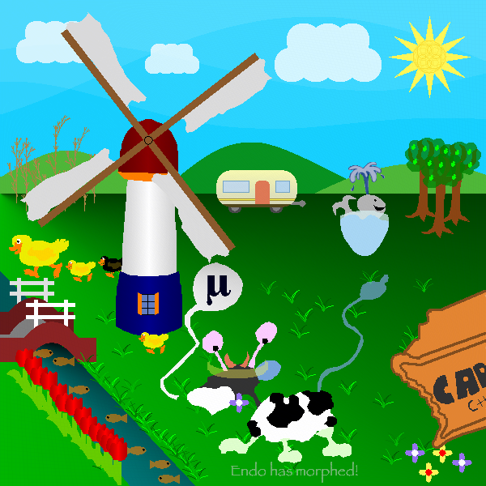
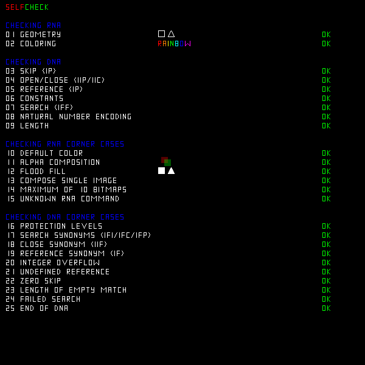
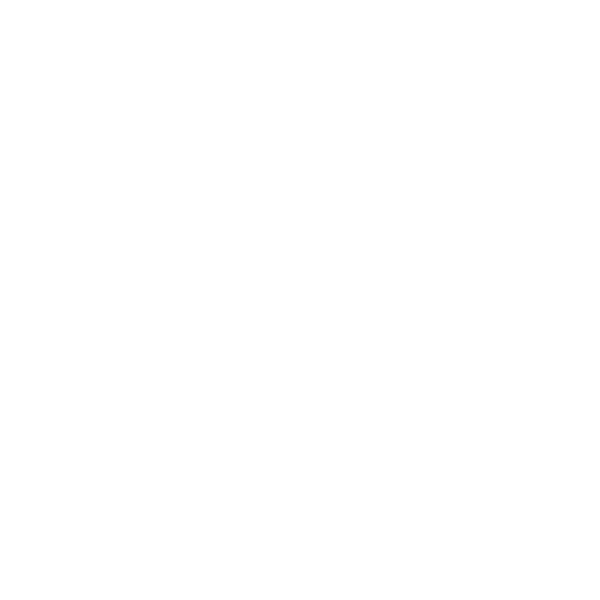
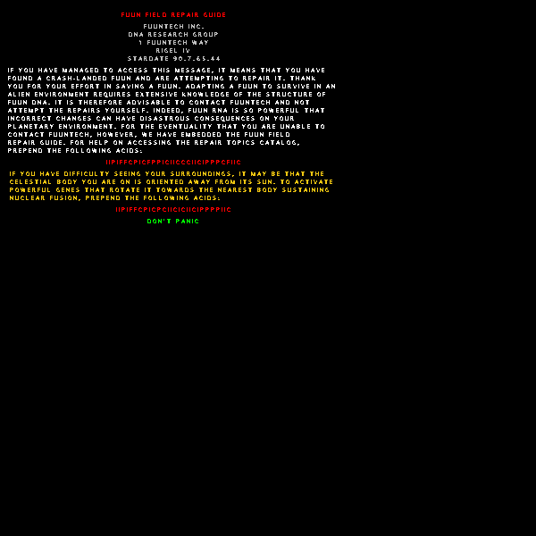

# Endo - ICFP 2007

An implementation and walkthrough of the [ICFP 2007 Programming Contest](http://save-endo.cs.uu.nl/) in Rust.
The task is described in [Endo.pdf](Endo.pdf).

## Components

### DNA -> RNA

In `src\dna.rs` there is an implementation of the DNA->RNA processor.

This uses a rope data structure from the `xi-editor` project.  A copy of the crate is in `rope`.

### RNA -> Image

In `src\rna.rs` there is an implementation of the RNA renderer.

This generates a full `.png` by default, but can render intermediate steps in the rendering with the `-i` flag.

## Walkthrough

Our goal is to generate the target Endo image:



First, make sure things build.

```bash
cargo build --release
```

Render the original Endo image with no prefix. This takes 30-60 seconds.

```bash
cargo run --release
```


In `Endo.pdf` on page 21 there is a hint to try a prefix of `IIPIFFCPICICIICPIICIPPPICIIC`.

```bash
cargo run --release -- IIPIFFCPICICIICPIICIPPPICIIC
```



We can see what the prefix looks like by logging the DNA processing

```bash
cargo run --release -- -l IIPIFFCPICICIICPIICIPPPICIIC | more
```

Which gives

```
iteration = 0
dna = IIPIFFCPIC... (7523088 bases)
pattern  (?"IFPP")F
template \0P
succesful match of length 13704
e[0] = IIIPIPIIPC... (13703 bases)
len(rna) = 0
```

So this prefix is flipping a bit from `F` to `P` at a location 13704 into the original DNA.

We can manually see that the prefix `IIPIFFCPICICIICPIICIPPPICIIC` decodes to `IIP IFF CPICIC IIC P IIC IP P P IC IIC` which matches the resutls above:

* Pattern: `(?"IFPP")F`
* Template: `\0P`

Let's see what happened in the intermediate steps as we were drawing that image (note - this step is easy to miss if you generate the image all at once instead of interactively, and don't need to debug our implementation).
 
```bash
cargo run --release -- -i IIPIFFCPICICIICPIICIPPPICIIC
```

The first 13 frames draw a new prefix, before erasing it and starting to render the real thing.


    
We can decode this prefix to see what it does:

```bash
cargo run --release -- -l IIPIFFCPICFPPICIICCIICIPPPFIIC | more
```

```
iteration = 0
dna = IIPIFFCPIC... (7523090 bases)
pattern  (?"IFPCFFP")I
template \0C
succesful match of length 14868
e[0] = IIIPIPIIPC... (14867 bases)
len(rna) = 0
```

So, similar to the previous prefix, it flips a bit from `I` to `C` at a location 14868 bases into the original DNA.  The resulting image is:

```bash
cargo run --release -- IIPIFFCPICFPPICIICCIICIPPPFIIC
```



Rotate the sun per the Fuun Field Repair Guide.

```bash
cargo run --release -- IIPIFFCPICPCIICICIICIPPPPIIC
```


