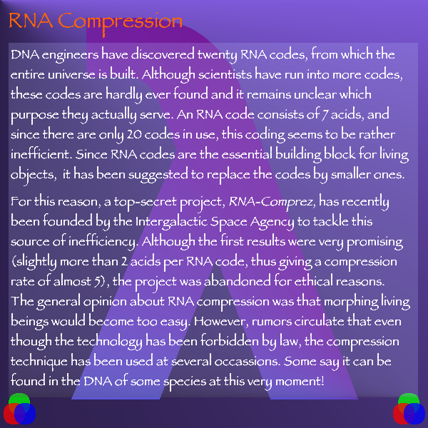

# Endo - ICFP 2007

An implementation and walkthrough of the [ICFP 2007 Programming Contest](http://save-endo.cs.uu.nl/) in Rust.
The task is described in [Endo.pdf](Endo.pdf).

## Components

### DNA -> RNA

In `src\dna.rs` there is an implementation of the DNA->RNA processor.

This uses a rope data structure from the `xi-editor` project.  A copy of the crate is in `rope`.

### RNA -> Image

In `src\rna.rs` there is an implementation of the RNA renderer.

This generates a full `.png` by default, but can render intermediate steps in the rendering with the `-i` flag.

## Walkthrough

Our goal is to generate the target Endo image:


First, make sure things build.

```bash
> cargo build --release
```

Render the original Endo image with no prefix. This takes 30-60 seconds.

```bash
> cargo run --release
```


In `Endo.pdf` on page 21 there is a hint to try a prefix of `IIPIFFCPICICIICPIICIPPPICIIC`.

```bash
> cargo run --release -- IIPIFFCPICICIICPIICIPPPICIIC
```


We can see what the prefix looks like by logging the DNA processing

```bash
> cargo run --release -- -l IIPIFFCPICICIICPIICIPPPICIIC | more

iteration = 0
dna = IIPIFFCPIC... (7523088 bases)
pattern  (?"IFPP")F
template \0P
succesful match of length 13704
e[0] = IIIPIPIIPC... (13703 bases)
len(rna) = 0
```

So this prefix is flipping a bit from `F` to `P` at a location 13703 into the original DNA.

We can manually see that the prefix `IIPIFFCPICICIICPIICIPPPICIIC` decodes to `IIP IFF CPICIC IIC P IIC IP P P IC IIC` which matches the resutls above:

* Pattern: `(?"IFPP")F`
* Template: `\0P`

Let's see what happened in the intermediate steps as we were drawing that image (note - this step is easy to miss if you generate the image all at once instead of interactively, and don't need to debug our implementation).
 
```bash
> cargo run --release -- -i IIPIFFCPICICIICPIICIPPPICIIC
```

The first 13 frames draw a new prefix, before erasing it and starting to render the real thing.


    
We can decode this prefix to see what it does:

```bash
> cargo run --release -- -l IIPIFFCPICFPPICIICCIICIPPPFIIC | more

iteration = 0
dna = IIPIFFCPIC... (7523090 bases)
pattern  (?"IFPCFFP")I
template \0C
succesful match of length 14868
e[0] = IIIPIPIIPC... (14867 bases)
len(rna) = 0
```

So, similar to the previous prefix, it flips a bit from `I` to `C` at a location 14867 bases into the original DNA.  The resulting image is:

```bash
> cargo run --release -- IIPIFFCPICFPPICIICCIICIPPPFIIC
```


There are two new prefixes here.  Let's start with the second, which rotates the sun.

```bash
> cargo run --release -- -l IIPIFFCPICPCIICICIICIPPPPIIC | more

iteration = 0
dna = IIPIFFCPIC... (7523090 bases)
pattern  (?"IFPCFFP")I
template \0C
succesful match of length 14868
e[0] = IIIPIPIIPC... (14867 bases)
len(rna) = 0
```

Again, flipping a base from `I` to `C` at 14867 bases into the DNA.  This produces:

```bash
> cargo run --release -- IIPIFFCPICPCIICICIICIPPPPIIC
```


Nice - this is a significant improvement!  *TODO: Compute the `risk` associated with the image - this one is much lower risk than the original*.

### Fuun Field Repair Guide Pages

The other prefix from the Fuun Field Repair Guide produces:

```
> cargo run --release -- -l IIPIFFCPICFPPICIICCCIICIPPPCFIIC | more

iteration = 0
dna = IIPIFFCPIC... (7523092 bases)
pattern  (?"IFPCFFP")II
template \0IC
succesful match of length 14869
e[0] = IIIPIPIIPC... (14867 bases)
len(rna) = 0
```

This makes an edit in the same location as the previous code - but instead of `I -> C`, it changes `II -> IC`.  The result is significantly different.

```
> cargo run --release -- IIPIFFCPICFPPICIICCCIICIPPPCFIIC
```


It looks like integers are being encoded as bianry using `C = 1` and `I = 0`, but in reverse order (`ith least significant bit` counting from left) so that, for example, `4 = IIC`.  According to this, the previous two pages appear to be page `1` and `2`, with page "`0`" being the original Endo code with no modifications.  In fact, this is exatly the integer format that the `nat` function in the DNA implementation uses.

To check that - lets see what the DNA looks like at the locatin where the first occurence of "IFPCFFP" appears:

```
...IFPCFFPIIIIIIIIIIIIIIIIIIIIIIIPIFPFPIIIIIIIIPIFPFIPIIIIIIIIIIIIIIIIIIIIIIIP...  
```

We can see `0` represented with 23 bases (24 including the closing `P` base).  (Note that we see a similar 23 base `0` just a little later).

We already have rendered page `1` and `2` - what about `3 = CC`? 

Let's desconstruct the prefix.

* Start pattern
* `IIP` -> `(`
* `IFF C P IC F P P IC` -> `?"IFPCFFP"`
* `IIC` -> `)`
* `CC` -> `II`
* `IIC` -> End pattern
* Start tempalte
* `IP P P` -> `\0` 
* `CF` -> `IC`
* `IIC` -> End template

Let's expand this from 2 bits to all 23 bits for flexibility:

* Start pattern
* `IIP` -> `(`
* `IFF C P IC F P P IC` -> `?"IFPCFFP"`
* `IIC` -> `)`
* `CCCCCCCCCCCCCCCCCCCCCCC` -> `IIIIIIIIIIIIIIIIIIIIIII`
* `IIC` -> End pattern
* Start tempalte
* `IP P P` -> `\0` 
* `CFCCCCCCCCCCCCCCCCCCCCC` -> `ICIIIIIIIIIIIIIIIIIIIII`
* `IIC` -> End template

Running this, we get the same result as before, since we make the same change to the DNA:

```
> cargo run --release -- IIPIFFCPICFPPICIICCCCCCCCCCCCCCCCCCCCCCCCIICIPPPCFCCCCCCCCCCCCCCCCCCCCCIIC
```

But we can now try to get more pages - like page 3 - by replacing `CFCC...` with `FFCC...`.

```
> cargo run --release -- IIPIFFCPICFPPICIICCCCCCCCCCCCCCCCCCCCCCCCIICIPPPFFCCCCCCCCCCCCCCCCCCCCCIIC
```


The style of the page is similar, but not yet clear what this means.


Generating page 4, we see that not all pages are present. There's a `-p` flag available for generating these pages by number instead of explicit prefix, so we'll use that.

```
> cargo run --release -- -p 4
```


But generating page 5, it appears there are still more interesting pages left.

```
> cargo run --release -- -p 5
```


Another topic to come back and explore later.

The Repair Guide Navigation page mentioned _page index 1337_, so let's try that one.  1337 = 10100111001 which in reverse is 10011100101 which becomes FCCFFFCCFCFCCCCCCCCCCCC in our integer encoding.

```
> cargo run --release -- -p 1337
```


A few insights:

* `5` matches what we already saw with the Lindemayer systems page
* `999999999` is too large to fit inside 23 bits.
* `4405829` does fit exactly in 23 bits, so all of the rest are legal pages
* The catalog page is `damaged` - so perhaps there are more pages that are interesting?

Let's generate all of the pages listed that we don't have yet.
```bash
cargo run --release -- -p 1729
cargo run --release -- -p 8
cargo run --release -- -p 23
cargo run --release -- -p 42
cargo run --release -- -p 112
cargo run --release -- -p 10646
cargo run --release -- -p 85
cargo run --release -- -p 84
cargo run --release -- -p 2181889
cargo run --release -- -p 4405829
cargo run --release -- -p 123456
``` 

All of these work, except for 23 and 84, which fail to decode corrently.  __TODO: The currently stack overflow, which is probably our bug.  What intermediate images do they produce?__




_TODO: Are there other legal pages that weren't in the index?_

Let's explore some of the topics mentioned in these pages one by one.

### Structure of the Fuun Genome

At 'runtime' the Fuun genome appears to have a code section (`red zone`) a data section (`green zone`) and a stack-like section (`blue zone`)


The `Blue Zone` appears to start at `IFPICFPPCFIPP`.  Checking in `endo.dna`, we see that the only occurence of that string is very clone to the end:

```
....IFPICFPPCFIPP IFPICFPPCCIIFPICFPPCIFFPIFPICFPPCIFP
```

So the Blue Zone initially contains `IFPICFPPCCIIFPICFPPCIFFPIFPICFPPCIFP`.

### Field-repairing Fuuns

_ TODO _

### Gene table

_ TODO _

### Encodings

_ TODO _

### RNA 'morphing' codes

_ TODO _

### Fuun Security Features

_ TODO _

### Stenography 

_ TODO _

### L-Systems 

_ TODO _

### Intergalactic Character Set 

_ TODO _

### RNA Compression

_ TODO _
