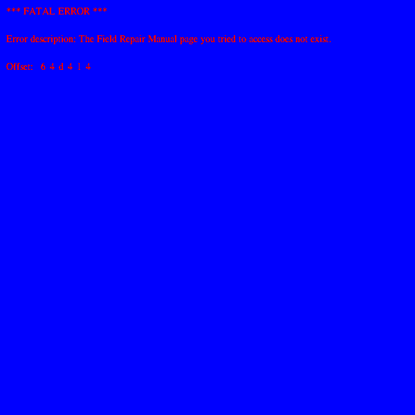

# Endo - ICFP 2007

An implementation and walkthrough of the [ICFP 2007 Programming Contest](http://save-endo.cs.uu.nl/) in Rust.
The task is described in [Endo.pdf](Endo.pdf).

## Components

### DNA -> RNA

In `src\dna.rs` there is an implementation of the DNA->RNA processor.

This uses a rope data structure from the `xi-editor` project.  A copy of the crate is in `rope`.

### RNA -> Image

In `src\rna.rs` there is an implementation of the RNA renderer.

This generates a full `.png` by default, but can render intermediate steps in the rendering with the `-i` flag.

## Walkthrough

Our goal is to generate the target Endo image:


First, make sure things build.

```bash
> cargo build --release
```

Render the original Endo image with no prefix. This takes 30-60 seconds.

```bash
> cargo run --release
```


In `Endo.pdf` on page 21 there is a hint to try a prefix of `IIPIFFCPICICIICPIICIPPPICIIC`.

```bash
> cargo run --release -- IIPIFFCPICICIICPIICIPPPICIIC
```


We can see what the prefix looks like by logging the DNA processing

```bash
> cargo run --release -- -l IIPIFFCPICICIICPIICIPPPICIIC | more

iteration = 0
dna = IIPIFFCPIC... (7523088 bases)
pattern  (?"IFPP")F
template \0P
succesful match of length 13704
e[0] = IIIPIPIIPC... (13703 bases)
len(rna) = 0
```

So this prefix is flipping a bit from `F` to `P` at a location 13703 into the original DNA.

We can manually see that the prefix `IIPIFFCPICICIICPIICIPPPICIIC` decodes to `IIP IFF CPICIC IIC P IIC IP P P IC IIC` which matches the resutls above:

* Pattern: `(?"IFPP")F`
* Template: `\0P`

Let's see what happened in the intermediate steps as we were drawing that image (note - this step is easy to miss if you generate the image all at once instead of interactively, and don't need to debug our implementation).
 
```bash
> cargo run --release -- -i IIPIFFCPICICIICPIICIPPPICIIC
```

The first 13 frames draw a new prefix, before erasing it and starting to render the real thing.


    
We can decode this prefix to see what it does:

```bash
> cargo run --release -- -l IIPIFFCPICFPPICIICCIICIPPPFIIC | more

iteration = 0
dna = IIPIFFCPIC... (7523090 bases)
pattern  (?"IFPCFFP")I
template \0C
succesful match of length 14868
e[0] = IIIPIPIIPC... (14867 bases)
len(rna) = 0
```

So, similar to the previous prefix, it flips a bit from `I` to `C` at a location 14867 bases into the original DNA.  The resulting image is:

```bash
> cargo run --release -- IIPIFFCPICFPPICIICCIICIPPPFIIC
```


There are two new prefixes here.  Let's start with the second, which rotates the sun.

```bash
> cargo run --release -- -l IIPIFFCPICPCIICICIICIPPPPIIC | more

iteration = 0
dna = IIPIFFCPIC... (7523090 bases)
pattern  (?"IFPCFFP")I
template \0C
succesful match of length 14868
e[0] = IIIPIPIIPC... (14867 bases)
len(rna) = 0
```

Again, flipping a base from `I` to `C` at 14867 bases into the DNA.  This produces:

```bash
> cargo run --release -- IIPIFFCPICPCIICICIICIPPPPIIC
```


Nice - this is a significant improvement!  *TODO: Compute the `risk` associated with the image - this one is much lower risk than the original*.

### Fuun Field Repair Guide Pages

The other prefix from the Fuun Field Repair Guide produces:

```
> cargo run --release -- -l IIPIFFCPICFPPICIICCCIICIPPPCFIIC | more

iteration = 0
dna = IIPIFFCPIC... (7523092 bases)
pattern  (?"IFPCFFP")II
template \0IC
succesful match of length 14869
e[0] = IIIPIPIIPC... (14867 bases)
len(rna) = 0
```

This makes an edit in the same location as the previous code - but instead of `I -> C`, it changes `II -> IC`.  The result is significantly different.

```
> cargo run --release -- IIPIFFCPICFPPICIICCCIICIPPPCFIIC
```


It looks like integers are being encoded as bianry using `C = 1` and `I = 0`, but in reverse order (`ith least significant bit` counting from left) so that, for example, `4 = IIC`.  According to this, the previous two pages appear to be page `1` and `2`, with page "`0`" being the original Endo code with no modifications.  In fact, this is exatly the integer format that the `nat` function in the DNA implementation uses.

To check that - lets see what the DNA looks like at the locatin where the first occurence of "IFPCFFP" appears:

```
...IFPCFFPIIIIIIIIIIIIIIIIIIIIIIIPIFPFPIIIIIIIIPIFPFIPIIIIIIIIIIIIIIIIIIIIIIIP...  
```

We can see `0` represented with 23 bases (24 including the closing `P` base).  (Note that we see a similar 23 base `0` just a little later).

We already have rendered page `1` and `2` - what about `3 = CC`? 

Let's desconstruct the prefix.

* Start pattern
* `IIP` -> `(`
* `IFF C P IC F P P IC` -> `?"IFPCFFP"`
* `IIC` -> `)`
* `CC` -> `II`
* `IIC` -> End pattern
* Start tempalte
* `IP P P` -> `\0` 
* `CF` -> `IC`
* `IIC` -> End template

Let's expand this from 2 bits to all 23 bits for flexibility:

* Start pattern
* `IIP` -> `(`
* `IFF C P IC F P P IC` -> `?"IFPCFFP"`
* `IIC` -> `)`
* `CCCCCCCCCCCCCCCCCCCCCCC` -> `IIIIIIIIIIIIIIIIIIIIIII`
* `IIC` -> End pattern
* Start tempalte
* `IP P P` -> `\0` 
* `CFCCCCCCCCCCCCCCCCCCCCC` -> `ICIIIIIIIIIIIIIIIIIIIII`
* `IIC` -> End template

Running this, we get the same result as before, since we make the same change to the DNA:

```
> cargo run --release -- IIPIFFCPICFPPICIICCCCCCCCCCCCCCCCCCCCCCCCIICIPPPCFCCCCCCCCCCCCCCCCCCCCCIIC
```

But we can now try to get more pages - like page 3 - by replacing `CFCC...` with `FFCC...`.

```
> cargo run --release -- IIPIFFCPICFPPICIICCCCCCCCCCCCCCCCCCCCCCCCIICIPPPFFCCCCCCCCCCCCCCCCCCCCCIIC
```


The style of the page is similar, but not yet clear what this means.


Generating page 4, we see that not all pages are present. There's a `-p` flag available for generating these pages by number instead of explicit prefix, so we'll use that.

```
> cargo run --release -- -p 4
```



But generating page 5, it appears there are still more interesting pages left.

```
> cargo run --release -- -p 5
```


Another topic to come back and explore later.

The Repair Guide Navigation page mentioned _page index 1337_, so let's try that one.  1337 = 10100111001 which in reverse is 10011100101 which becomes FCCFFFCCFCFCCCCCCCCCCCC in our integer encoding.

```
> cargo run --release -- -p 1337
```


A few insights:

* `5` matches what we already saw with the Lindemayer systems page
* `999999999` is too large to fit inside 23 bits.
* `4405829` does fit exactly in 23 bits, so all of the rest are legal pages
* The catalog page is `damaged` - so perhaps there are more pages that are interesting?

Let's generate all of the pages listed that we don't have yet.
```bash
cargo run --release -- -p 1729
cargo run --release -- -p 8
cargo run --release -- -p 23
cargo run --release -- -p 42
cargo run --release -- -p 112
cargo run --release -- -p 10646
cargo run --release -- -p 85
cargo run --release -- -p 84
cargo run --release -- -p 2181889
cargo run --release -- -p 4405829
cargo run --release -- -p 123456
``` 

All of these work, except for 23 and 84, which fail to decode corrently.  __TODO: The currently stack overflow, which is probably our bug.  What intermediate images do they produce?__


_TODO: Are there other legal pages that weren't in the index?_

Let's explore some of the topics mentioned in these pages one by one.

### Structure of the Fuun Genome

At 'runtime' the Fuun genome appears to have a code section (`red zone`) a data section (`green zone`) and a stack-like section (`blue zone`)


According to the `Gene Table` page the `Green Zone` starts at `IFPICFPPCFFPP`.  In the original Endo this occurs at 13616-13629.

According to `Field Repairing Fuuns` the `Blue Zone` starts at `IFPICFPPCFIPP`.  In the original Endo this occurs at 7523012-7523025.  That location is very clone to the end:

```
....IFPICFPPCFIPP IFPICFPPCCIIFPICFPPCIFFPIFPICFPPCIFP
```

So the Blue Zone initially contains exactly `IFPICFPPCCIIFPICFPPCIFFPIFPICFPPCIFP`.  _Note: Step 5,6,7,etc. of the DNA process grow this section by matching the latter part `IFPICFPPCIFF`, `P`, `IFPICFPPCIFP`._ 

This suggests that the `Green Zone` is 7509383 bases between the markers, 7509396 bases with one marker and 7509409 bases with both markers.   

So our original DNA has Red/Green/Blue = 13689/7509409/36.

Let's go back and look at the beginning of the trace of running `endo.dna`.  We'll annotate each step with an interpretation now that we understand a bit about the Fuun Genome structure.

```
iteration = 0
dna = IIPIFFCPIC... (7523134 bases)
pattern  (?"IFPCFFP")IIIIIIIIIIIIIIIIIIIIIII
template \0IIIIIIIIIIIIIIIIIIIIIII
len(pattern + template) = 74
succesful match of length 14890
e[0] = IIIPIPIIPC... (14867 bases)
len(rna) = 0
```

Looks for a 23-base `0` at a certain location and replaces it with `0` - doing nothing.  This is the same location we modified to find the repair guide pages - so it looks like this is just here as another hint.

Result is 13615/7509409/36.

```
iteration = 1
dna = IIIPIPIIPC... (7523060 bases)
pattern  !0(!4536645(!800)!2971964)
template \0\1IIIIIIIIIIIIIIIIIIIIIIIPIIIIIIIIIIIIIIIIIIIIIIIP
len(pattern + template) = 13615
succesful match of length 7509409
e[0] = IIICCCCPIC... (800 bases)
e[1] = IFPICFPPCF... (7509409 bases)
len(rna) = 1343
```

The long match here is 7509409 bases, which is the length of the green zone, and the template places three things, with the green zone length part in the middle unchanged.

* Red: The 800 bases pulled from index 4536645 in the green zone.
* Green: Unmodified green zone segment
* Blue: Two 23 base `0`s at the front of the blue zone, followed by the original 36 bytes in the blue zone.

This feels like a "function call" using the requested 800 bases of function code. 

Result is 800/7509409/84.

```
iteration = 2
dna = IIICCCCPIC... (7510293 bases)
pattern  !605(!2345486(!2574)!5161349)
template \0\1IIICIIIIICICCCIICICIIICPCICCCICIICIIIIIIIIIIIIIP
len(pattern + template) = 195
succesful match of length 7510014
e[0] = IIICIPIICC... (2574 bases)
e[1] = IFPICFPPCF... (7509409 bases)
len(rna) = 1344
```

Again, the green zone remains intact in the middle.  This time though, the pattern skips past 605 bases and throws them away, prepending 2574 bases from location 2345486 in the Green Zone.  Finally, the Blue zone is prepended with another two integers - `IIICIIIIICICCCIICICIIICP = 10001010011101000001000 = 4536840` and `CICCCICIICIIIIIIIIIIIIIP = 1001011101 = 605`.  The latter is the number of bases we threw away.  The former is 195 bases into the 800 bases of the previous 'call'.

Result is 2574/7509409/132.

```
iteration = 3
dna = IIICIPIICC... (7512115 bases)
pattern  (!7511905)
template \0CIIIICICCICICIICICIICCCP
len(pattern + template) = 78
succesful match of length 7511905
e[0] = IIPIPIICCI... (7511905 bases)
len(rna) = 1345
```

Places the number `CIIIICICCICICIICICIICCCP = 7509409` at location 7511905, which is the front of the Blue Zone. 

Result is 2496/7509409/156.

```
iteration = 4
dna = IIPIPIICCI... (7512061 bases)
pattern  (!823916P)
template IPCCIICICIIIICIIIIIIIIIIIPIICIIC\0
len(pattern + template) = 79
failed match
len(rna) = 1345
```

Tests whether a P occurs at 823916 which is 823916 - 2496 + 79 = 821499 bases into the green zone.

If this had matched, it would put some new code in the red zone which would have done `IPCCIICICIIIICIIIIIIIIIIIPIICIIC = /!2131//`, skipping to past a large piece of the red zone code.

But it doesn't in this case.

Result is 2417/7509409/156.

```
iteration = 5
dna = IIPIPCIIII... (7511982 bases)
pattern  (!7509409?"IFPICFPPCIFF")(!1)(IFPICFPPCIFP)
template \0\1\1\1\1\2
len(pattern + template) = 119
succesful match of length 7511863
e[0] = IIPIPCIIII... (7511850 bases)
e[1] = P (1 bases)
e[2] = IFPICFPPCI... (12 bases)
len(rna) = 1345
```

Searches for `IFPICFPPCIFF` and `IFPICFPPCIFP` seperated by one base (skipping by the length of the green zone, though this doesn't appear to be necessary since these markers are still unique.  This matches the very end of the DNA with a `P` in between.  Multiplies this one `P` into four.

Result is 2298/7509409/159.

```
iteration = 6
dna = IIPIPCIIII... (7511866 bases)
pattern  (!7509409?"IFPICFPPCIFF")(!4)(IFPICFPPCIFP)
template \0\1\1\1\1\2
len(pattern + template) = 121
succesful match of length 7511745
e[0] = IIPIPCIIII... (7511729 bases)
e[1] = PPPP (4 bases)
e[2] = IFPICFPPCI... (12 bases)
len(rna) = 1345
```

This and the next several instr4uctions multiple the `P` section by 4 again, ultimately growing it to 1048576 bases.

After iteration 14, the result is 1137/7509409/1048731.

```
iteration = 15
dna = IIPIPICCCC... (8559277 bases)
pattern  (!7510430(!3))
template IIPIPCCPIICIIPIPICICIIICCIICCIICICIICCCPIICIPCCPIICIPPCPIPPPIIC\0\1
len(pattern + template) = 136
succesful match of length 7510433
e[0] = CCC (3 bases)
e[1] = IIPIPICCII... (7510433 bases)
len(rna) = 1345
```

Grabs the last 3 bases of the 23-length base at the front of the blue zone (which is `CCC`).  Duplicates them - creating a 26 base number ` = 66229665`.  Not clear what this is for.

Also prepends the red zone with some code to run next.

Result is 1064/7509409/1048734.

### Gene table

The previous section gave a pretty good understanding of the runtime behaviour of Fuun DNA.

A mechanism that appeared several times was copying a section of 'code' from the Blue Zone to the Red Zone.

The Gene Table has some suggestions about the structure of the Green Zone.


Each entry has what looks like an offset and a length.  The largest offset is `0x719633 = 7444019` which fits nicely inside the green zone.

It seems reasonable to assume each offset is an offset into the green zone, and each length is the length of a block of code, or perhaps some constant data used by code, at that location.  

Notably, this is just page 1 of 14.  But the first entry is suggestively named `AAA_geneTablePageNr`, and is `0x18 = 24` bases long, suggesting that if we overwrite the page number there, a different page will be rendered.  

To try to get gene table page 2, we need to prefix our prefix page 42 prefix with `/(?"IFPICFPPCFFPP"!1283)(!24)/\0ICIIIIIIIIIIIIIIIIIIIIIP/`.  This is `IIP IFF C P IC C F P IC IC F P P IC IC IP CCIIIIIICICP IIC IIP IP IIICCP IIC IIC IP P P CFCCCCCCCCCCCCCCCCCCCCCIC IIC` = `IIPIFFCPICCFPICICFPPICICIPCCIIIIIICICPIICIIPIPIIICCPIICIICIPPPCFCCCCCCCCCCCCCCCCCCCCCICIIC`.


Combining prefixes - we try:

```bash
> cargo run --release -- -l IIPIFFCPICCFPICICFPPICICIPCCIIIIIICICPIICIIPIPIIICCPIICIICIPPPCFCCCCCCCCCCCCCCCCCCCCCICIICIIPIFFCPICFPPICIICCCCCCCCCCCCCCCCCCCCCCCCIICIPPPCFCFCFCCCCCCCCCCCCCCCCCIIC | more

iteration = 0
dna = IIPIFFCPIC... (7523224 bases)
pattern  (?"IFPICFPPCFFPP"!1283)(!24)
template \0ICIIIIIIIIIIIIIIIIIIIIIP
len(pattern + template) = 90
succesful match of length 15009
e[0] = IIPIFFCPIC... (14985 bases)
e[1] = IIIIIIIIII... (24 bases)
len(rna) = 0

iteration = 1
dna = IIPIFFCPIC... (7523134 bases)
pattern  (?"IFPCFFP")IIIIIIIIIIIIIIIIIIIIIII
template \0ICICICIIIIIIIIIIIIIIIII
len(pattern + template) = 74
succesful match of length 14890
e[0] = IIIPIPIIPC... (14867 bases)
len(rna) = 0

> cargo run --release -- IIPIFFCPICCFPICICFPPICICIPCCIIIIIICICPIICIIPIPIIICCPIICIICIPPPCFCCCCCCCCCCCCCCCCCCCCCICIICIIPIFFCPICFPPICIICCCCCCCCCCCCCCCCCCCCCCCCIICIPPPCFCFCFCCCCCCCCCCCCCCCCCIIC 
```


We can get the rest of the gene table pages with a new flag `-g`.

```
cargo run --release -- -g 1
cargo run --release -- -g 2 
cargo run --release -- -g 3 
cargo run --release -- -g 4 
cargo run --release -- -g 5 
cargo run --release -- -g 6 
cargo run --release -- -g 7 
cargo run --release -- -g 8 
cargo run --release -- -g 9 
cargo run --release -- -g 10 
cargo run --release -- -g 11
cargo run --release -- -g 12
cargo run --release -- -g 13
cargo run --release -- -g 14
cargo run --release -- -g 15
```


We can look at what some of these code/data sections look like with the `-z` option:

```
> cargo run --release -- -z 0x000510:0x00018
Green zone at offset 1296 of length 24:
IIIIIIIIIIIIIIIIIIIIIIIP
```

Here's a summary of default values for a handful of interesting sections:

|Name|Offset|Length|Bases|
|----|------|------|-----|
|`greenZoneStart`|`0`|`0`||
|`doSelfCheck`|`88`|`1`|`F`|
|`AAA_geneTablePageNr`|`1296`|`24`|`IIIIIIIIIIIIIIIIIIIIIIIP`|
|`enableBioMorph`|`211299`|`1`|`F`|
|`colorReset`|`820970`|`1`|`P`|
|`blueZoneState`|`7509409`|`0`||


_TODO: Dissasemble the code sections?_

_TODO: Enable integrity checks?_

### Field-repairing Fuuns

_ TODO _


### Encodings

_ TODO _

### RNA 'morphing' codes

_ TODO _

### Fuun Security Features

_ TODO _

### Stenography 

_ TODO _

### L-Systems 

_ TODO _

### Intergalactic Character Set 

_ TODO _

### RNA Compression

_ TODO _


### Miscellaneous

```
> cargo run --release -- -z 0x5b7bf3:0x100
Green zone at offset 5995507 of length 256:
IIICPCPIPCIIPIPICCCCCIIICCCCCCICCIICCCIPIICIICIPPPICICICICICICIICIIPIIPIPIIIICCPIICIPCCCCIICCCICCCCCICCIICCCIPIICIICIPPCPIPPPIICIIPIPIICICICCCICCCCCICCIICCCIPIIPIPIIICCPIICIICIICCCICCICCCCFFICCCFCCICCICCFFFCFFCFCFFFFFCFFCCFFFICCCFCICCCCFFICCCFCICICFICCICIC

Decodes to:
III CPCPIPC IIP IP ICCCCCIIICCCCCCICCIICCCIP IIC IIC IP P P IC IC IC IC IC IC IIC IIPIIPIPIIIICCPIICIPCCCCIICCCICCCCCICCIICCCIPIICIICIPPCPIPPPIICIIPIPIICICICCCICCCCCICCIICCCIPIIPIPIIICCPIICIICIICCCICCICCCCFFICCCFCCICCICCFFFCFFCFCFFFFFCFFCCFFFICCCFCICCCCFFICCCFCICICFICCICIC

Outputs [CPCPIPC]/(!7568958)/\0PPPPPP/
```


